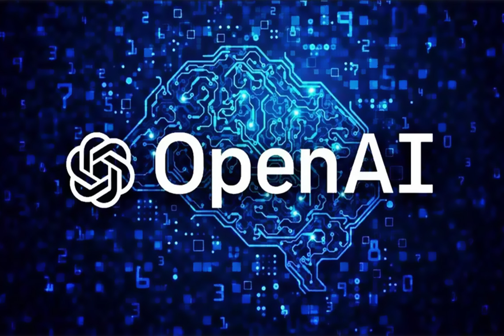

<h2 style="font-family: Arial, sans-serif;">Olá, tudo bem?</h2>
<h3 style="font-family: Arial, sans-serif;">Meu nome é Jolisson Vieira</h3>
<h3 style="font-family: Arial, sans-serif;">Sou Desenvolvedor Full Stack</h3>

  
  

<h2 style="font-family: Arial, sans-serif;">Contato</h2>

    

<h2 style="font-family: Arial, sans-serif;">Linguagens</h2>
<h3 style="font-family: Arial, sans-serif;">Front-end</h3>

    
    
    
    
    

<h3 style="font-family: Arial, sans-serif;">Back-end</h3>

    
    
    
    

<h2 style="font-family: Arial, sans-serif;">Estudos Atuais</h2>
<h3 style="font-family: Arial, sans-serif;">Inteligência Artificial</h3>

Atualmente, estou estudando Inteligência Artificial, focando em aprendizado de máquina, redes neurais e processamento de linguagem natural.

    

